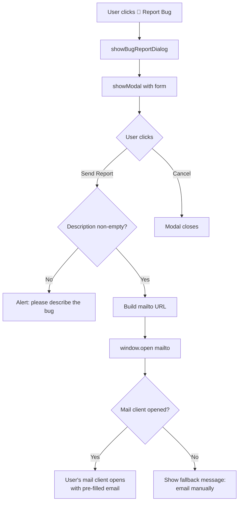

# Implementation Plan — Report Bug Button

> Companion to [BRIEF_11](../briefs/BRIEF_11_report_bug_button.md)
> Created: 2026-07-11

## Overview

Add a "Report Bug" button to the header toolbar that opens a modal form.
When submitted, it composes a `mailto:` link to
`mail@refracturedgames.com` with subject `bug-tectolite` and opens the
user's default mail client.

## Files modified

| File | Change | Status |
|---|---|---|
| `vite.config.ts` | Add `__APP_VERSION__` define from `package.json` | ✅ Done |
| `src/globals.d.ts` | New ambient declaration for `__APP_VERSION__` | ✅ Done |
| `src/canvas/CanvasManager.ts` | Add `captureScreenshot()` public method | ✅ Done |
| `src/ui/AppTemplate.ts` | Add `btn-report-bug` button in header-actions | ✅ Done |
| `src/main.ts` | Add event listener + `showBugReportDialog()` + helpers | ✅ Done |

No new npm dependencies. No CSS changes. No Electron IPC changes.

## Implementation steps

### Step 1 — Add `__APP_VERSION__` to Vite config

In `vite.config.ts`, read `package.json` at build time and inject the
version as a compile-time constant:

```typescript
import { readFileSync } from 'fs';
const pkg = JSON.parse(readFileSync(new URL('./package.json', import.meta.url), 'utf-8'));
// in defineConfig:
define: { __APP_VERSION__: JSON.stringify(pkg.version) }
```

Created `src/globals.d.ts` with `declare const __APP_VERSION__: string;`
for TypeScript. (Cannot be in `types.ts` — that's a module, so `declare
const` is module-scoped, not global.)

### Step 2 — Add `captureScreenshot()` to CanvasManager

In `src/canvas/CanvasManager.ts`, added:

```typescript
public captureScreenshot(): string {
    return this.canvas.toDataURL('image/png');
}
```

### Step 3 — Add button to header

In `src/ui/AppTemplate.ts`, inserted after `btn-import-json`:

```html
<button id="btn-report-bug" class="btn btn-secondary" title="Report a Bug">
    <span class="icon">🐛</span> Report Bug
</button>
```

### Step 4 — Wire event listener + implement dialog

In `src/main.ts`:
- Added `btn-report-bug` click listener in `setupEventListeners()`
- Added `showBugReportDialog()` method with form (Description, Steps,
  Severity, Email, Include screenshot checkbox)
- Added `dataUrlToBlob()` and `downloadScreenshot()` helper methods
- Screenshot: tries `navigator.clipboard.write()` with `ClipboardItem`,
  falls back to download
- Email: `mailto:mail@refracturedgames.com?subject=bug-tectolite&body=...`
- Fallback: `window.location.href = mailtoUrl` if `window.open` returns null

### Step 5 — Verify

```
npx tsc --noEmit    ✅ Pass (no errors)
npx vitest run      ✅ Pass (81 tests, 7 files, 0 failures)
npx vite build      ✅ Pass (278 modules, built in 1.06s)
```

All acceptance criteria greps verified. Manual testing required for
items 12–17 (visual/interaction tests).

## Diagram



## Risk assessment

- **Low risk**: Two-file change, no new dependencies, no data migration,
  no backend. Uses existing `showModal` infrastructure.
- **Main uncertainty**: Whether `showModal`'s dialog DOM is queryable
  after the call returns (needed to read form values). Probe by reading
  `showModal` source — it appends to `document.body`, so
  `document.getElementById('bug-description')` will find the elements.
  The existing time-input modal uses this exact pattern.
- **Edge case**: `window.open('mailto:...')` behavior varies by OS and
  mail client. Fallback message handles the failure case.